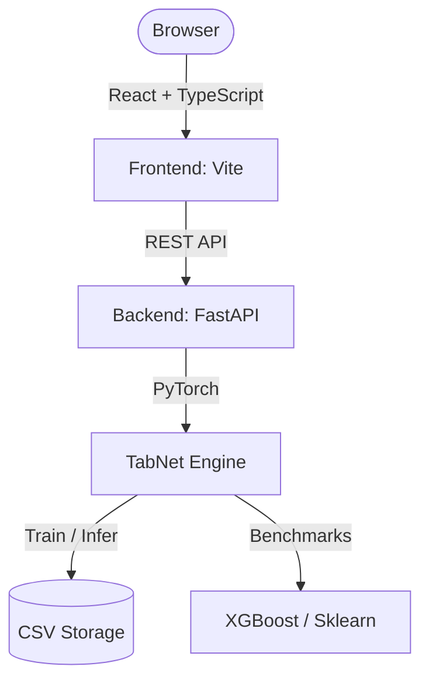
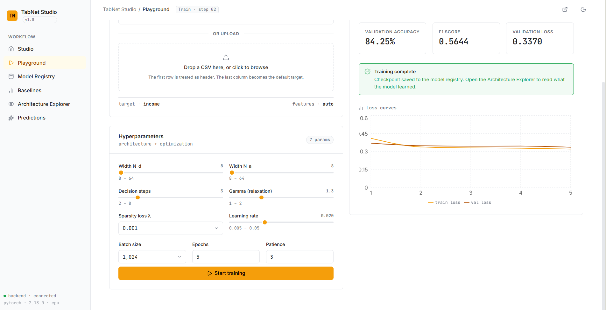
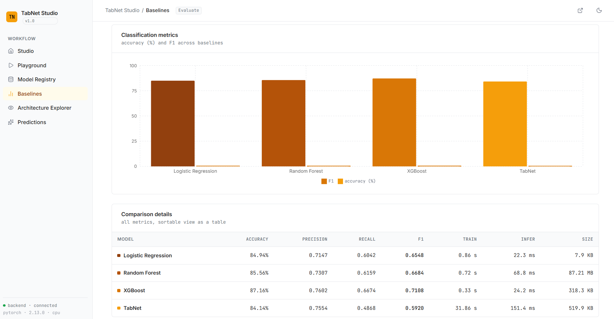
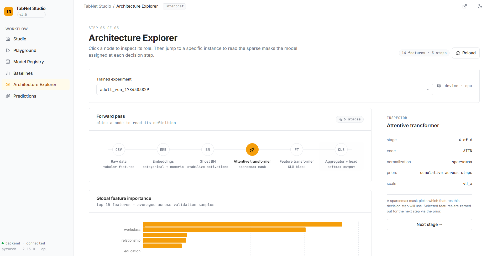

# TabNet Studio

[](https://github.com/Git-Kapish/TabNet-Studio/actions/workflows/ci.yml)
[](https://tab-net-studio.vercel.app)
[](./LICENSE)

A from-scratch PyTorch implementation of **TabNet: Attentive Interpretable Tabular Learning** (Arik & Pfister, 2019), built as a deep-dive into the paper's architecture — coupled with a full research workbench for training, visualising attention, benchmarking against classical baselines, and deploying batch predictions.

**[Try the live demo →](https://tab-net-studio.vercel.app)**

> **Paper:** S. Ö. Arik and T. Pfister, "TabNet: Attentive Interpretable Tabular Learning," *AAAI*, 2021. [`arXiv:1908.07442`](https://arxiv.org/abs/1908.07442)

---

## What This Is

This is **not** a wrapper around an existing library. Every component is implemented directly from the equations in §3 of the paper:

| Component                 | Paper Reference                  | File                              |
| -------------------------- | --------------------------------- | ---------------------------------- |
| Sparsemax activation      | §3.1, Martins & Astudillo (2016) | `tabnet/layers.py`                |
| Ghost Batch Normalisation | §3.1, Hoffer et al. (2017)       | `tabnet/layers.py`                |
| GLU Block                 | §3.1, Eq. 6                      | `tabnet/feature_transformer.py`   |
| Attentive Transformer     | §3.1, Eq. 2                      | `tabnet/attentive_transformer.py` |
| Prior Scale Update        | §3.1, Eq. 5                      | `tabnet/encoder.py`               |
| Decision Aggregation      | §3.2, Eq. 7                      | `tabnet/model.py`                 |
| Sparsity Regularisation   | §3.4, Eq. 9                      | `tabnet/losses.py`                |
| Feature Attribution       | §3.3, Eq. 8                      | `tabnet/interpretability.py`      |

---

## Results

Benchmarked against classical baselines on the same train/validation split (80/20), using the workbench's built-in **Baselines** comparison:

**Adult Census Income** (binary classification)

| Model | Accuracy | F1-Score | ROC-AUC | Train Time | Inference Latency |
|---|---|---|---|---|---|
| **TabNet** (this repo) | 83.75% | 0.7282 | 0.8993 | 30.60s | 236.23 ms |
| **XGBoost** | **87.16%** | **0.8142** | **0.9248** | **0.36s** | **51.46 ms** |
| **Random Forest** | 85.56% | 0.7880 | 0.9033 | 0.77s | 138.50 ms |
| **Logistic Regression** | 84.94% | 0.7792 | 0.9030 | 0.73s | 73.19 ms |

**Forest Covertype** (multi-class classification)

| Model | Accuracy | F1-Score | Train Time | Inference Latency |
|---|---|---|---|---|
| **TabNet** (this repo) | 68.14% | 0.3815 | 28.61s | 185.34 ms |
| **XGBoost** | 84.24% | 0.7727 | 1.53s | 21.51 ms |
| **Random Forest** | **87.09%** | **0.7880** | **0.90s** | **75.59 ms** |
| **Logistic Regression** | 72.61% | 0.5313 | 2.76s | 5.48 ms |

---

## System Architecture





### Architecture Deep Dive

The forward pass — from raw input through the repeated decision-step loop to the final prediction — maps directly onto the paper's equations:


Each decision step (repeated `N_steps` times) runs an Attentive Transformer to produce a sparse feature mask (Eq. 2), updates the prior scale so previously-used features are down-weighted in later steps (Eq. 5), and passes the masked features through a Feature Transformer (Eq. 6). Outputs from every step are aggregated (Eq. 7) into the final prediction, while the same per-step masks separately drive the sparsity regularization loss (Eq. 9) and the feature attribution / explainability output (Eq. 8) — the two things that make TabNet interpretable rather than just another neural net.

---

## Directory Structure

```
TabNet-Studio/
├── tabnet/                      # Core PyTorch library (pip-installable)
│   └── tabnet/
│       ├── layers.py            # Sparsemax (Eq. 2), Ghost BN (§3.1)
│       ├── attentive_transformer.py  # Attention mask M[i] (Eq. 2)
│       ├── feature_transformer.py   # GLU blocks + residuals (Eq. 6)
│       ├── encoder.py           # Sequential decision steps (Eqs. 2–5)
│       ├── model.py             # TabNetClassifier (Eqs. 7, §3.2)
│       ├── losses.py            # Sparsity loss (Eq. 9)
│       ├── interpretability.py  # Feature attribution (Eq. 8)
│       ├── embeddings.py        # Categorical embeddings + Input BN
│       ├── data.py              # Preprocessing pipelines
│       ├── metrics.py           # Accuracy / F1 computation
│       └── training.py          # Fit / validate loops
│
├── backend/                     # FastAPI REST server
│   ├── app/main.py              # All API endpoints
│   ├── requirements.txt
│   └── Dockerfile
│
├── frontend/                    # React + TypeScript dashboard
│   ├── src/components/
│   │   ├── Home.tsx             # Studio overview
│   │   ├── Train.tsx            # Live training + loss curves
│   │   ├── Results.tsx          # Model registry + exports
│   │   ├── Compare.tsx          # Baseline benchmarks
│   │   ├── Explainability.tsx   # Attention heatmaps
│   │   └── Predict.tsx          # Batch inference
│   ├── src/App.tsx
│   └── Dockerfile
│
├── tests/                       # PyTorch unit tests
│   ├── test_layers.py
│   ├── test_model.py
│   └── test_embeddings.py
│
├── .github/workflows/ci.yml     # CI/CD pipeline (GitHub Actions)
├── docker-compose.yml           # Multi-container orchestration
├── data/raw/                    # Preloaded datasets (Adult, Covertype)
└── artifacts/                   # Checkpoints, runs, TensorBoard logs
```

---

## Setup & Installation

### Prerequisites

<!-- TODO: confirm exact pinned versions against backend/requirements.txt and frontend/package.json -->
- Python 3.10+
- Node.js 18+
- PyTorch (see `backend/requirements.txt` for the pinned version)

### Option A — Docker (recommended)

```bash
docker compose up --build
```

- Frontend: `http://localhost:5173`
- Backend API: `http://localhost:8000`

### Option B — Local Development

**Backend:**

```bash
# Create and activate virtual environment
python -m venv .venv
.venv\Scripts\activate        # Windows
# source .venv/bin/activate   # macOS/Linux

pip install -r backend/requirements.txt
pip install -e ./tabnet

python -m uvicorn backend.app.main:app --host 0.0.0.0 --port 8000
```

**Frontend:**

```bash
cd frontend
npm install
npm run dev
```

---

## CI/CD Pipeline

Defined in [`.github/workflows/ci.yml`](https://github.com/Git-Kapish/TabNet-Studio/blob/main/.github/workflows/ci.yml).

| Job           | Trigger              | Steps                                        |
| ------------- | --------------------- | ---------------------------------------------- |
| `backend-ci`  | Push / PR to `main`  | Python 3.10 → install deps → `pytest tests/` |
| `frontend-ci` | Push / PR to `main`  | Node 20 → `npm ci` → lint → `npm run build`  |
| `publish`     | Merge to `main` only | Build & push Docker images to GHCR           |

---

## Workbench Features

### Playground

Configure hyperparameters (`N_steps`, `N_d`, `N_a`, `γ`, `λ_sparse`, learning rate, batch size, patience) and start training. Epoch-level loss and accuracy curves update live.



### Baselines

Automatically benchmarks TabNet against Logistic Regression, Random Forest, and XGBoost on the same dataset. Compare accuracy, F1, training time, inference latency, and checkpoint size. (Numbers from this view populate the [Results](#results) section above.)



### Architecture Explorer

Select any trained run and any validation sample. Visualises:

- The full forward-pass pipeline (Input BN → Attentive Transformer → Feature Transformer → Aggregation)
- Step-by-step Sparsemax attention heatmaps showing which features were selected at each decision step



### Predictions

Upload a test CSV, select a model, and run batch inference. Download the augmented CSV with predicted labels and class confidence scores.

---

## Design Philosophy

The frontend follows a dedicated design system ([`DESIGN.md`](./DESIGN.md)) rather than default component-library styling: an information-dense, low-chrome aesthetic modeled on tools like Weights & Biases and TensorBoard rather than a marketing UI. Color is used functionally — an amber accent reserved for active/selected states — not decoratively, and every chart/heatmap has a text-equivalent for accessibility.

---

## Running Tests

```bash
pytest tests/
```

---

## Paper Reference

```bibtex
@inproceedings{arik2021tabnet,
  title     = {TabNet: Attentive Interpretable Tabular Learning},
  author    = {Arik, Sercan {\"O}. and Pfister, Tomas},
  booktitle = {AAAI Conference on Artificial Intelligence},
  year      = {2021},
  url       = {https://arxiv.org/abs/1908.07442}
}
```

## License
MIT — see [`LICENSE`](./LICENSE).