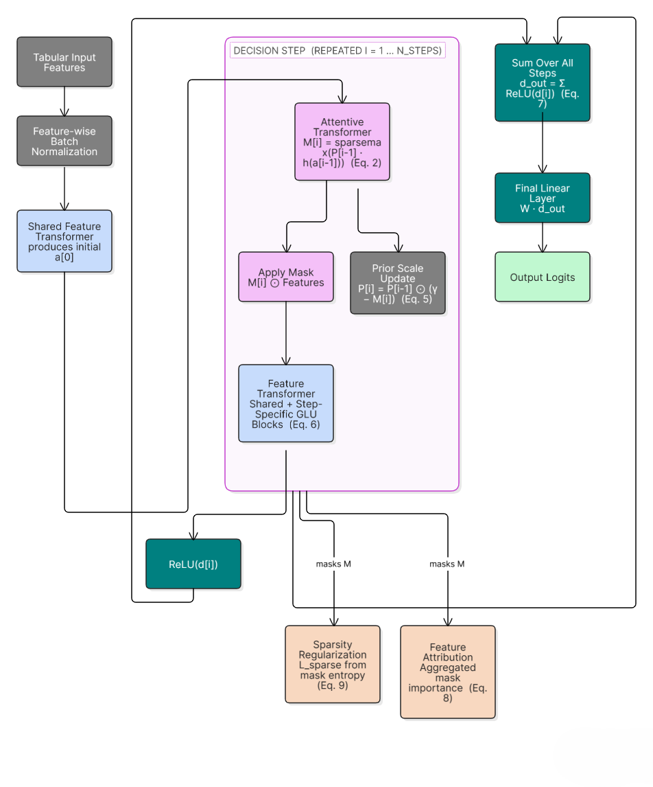
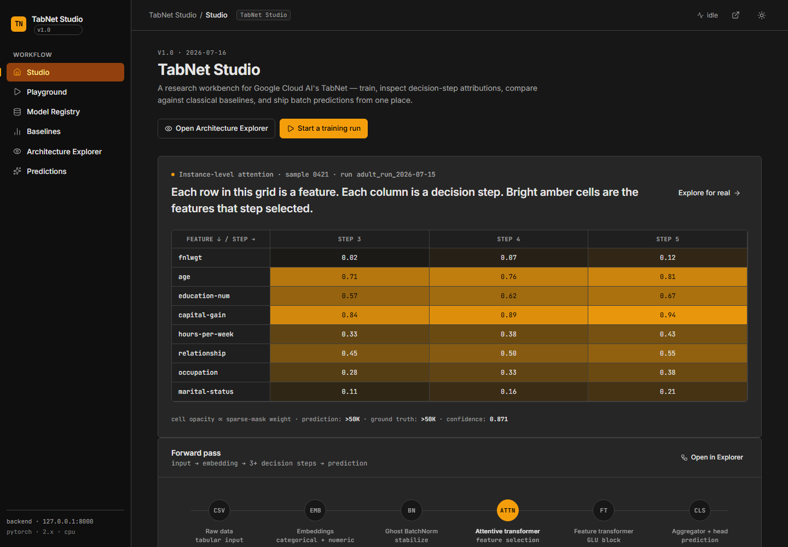
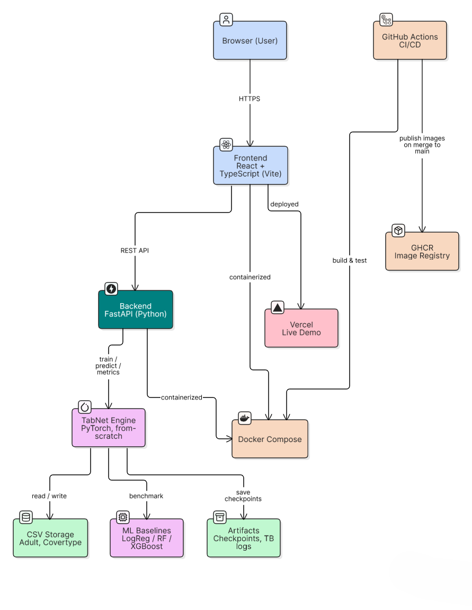

# TabNet Studio

[](https://github.com/Git-Kapish/TabNet-Studio/actions/workflows/ci.yml)
[](https://tab-net-studio.vercel.app)
[](LICENSE)

A from-scratch PyTorch implementation of **TabNet: Attentive Interpretable Tabular Learning** (Arik & Pfister, 2019), built as a personal deep-dive into the paper's architecture — coupled with a full research workbench for training, visualising attention, benchmarking, and deploying batch predictions.

> **Paper:** S. Ö. Arik and T. Pfister, "TabNet: Attentive Interpretable Tabular Learning," *AAAI*, 2021. [`arXiv:1908.07442`](https://arxiv.org/abs/1908.07442)

---

## What This Is

This is **not** a wrapper around an existing library. Every component is implemented directly from the equations in §3 of the paper:

| Component | Paper Reference | File |
|---|---|---|
| Sparsemax activation | §3.1, Martins & Astudillo (2016) | [`tabnet/layers.py`](tabnet/tabnet/layers.py) |
| Ghost Batch Normalisation | §3.1, Hoffer et al. (2017) | [`tabnet/layers.py`](tabnet/tabnet/layers.py) |
| GLU Block | §3.1, Eq. 6 | [`tabnet/feature_transformer.py`](tabnet/tabnet/feature_transformer.py) |
| Attentive Transformer | §3.1, Eq. 2 | [`tabnet/attentive_transformer.py`](tabnet/tabnet/attentive_transformer.py) |
| Prior Scale Update | §3.1, Eq. 5 | [`tabnet/encoder.py`](tabnet/tabnet/encoder.py) |
| Decision Aggregation | §3.2, Eq. 7 | [`tabnet/model.py`](tabnet/tabnet/model.py) |
| Sparsity Regularisation | §3.4, Eq. 9 | [`tabnet/losses.py`](tabnet/tabnet/losses.py) |
| Feature Attribution | §3.3, Eq. 8 | [`tabnet/interpretability.py`](tabnet/tabnet/interpretability.py) |

---

## Results

Classification performance, execution metrics, and storage footprints benchmarked on the **Adult Census Income** dataset ($N = 32,561$ rows, 14 features):

| Model | Accuracy | F1-Score | Training Time | Inference Latency (Batch) | Model Size |
|---|---|---|---|---|---|---|
| **XGBoost** | **87.16%** | **0.7108** | 0.33s | 24.21 ms | 326 KB |
| **Random Forest** | 85.56% | 0.6684 | 0.72s | 68.77 ms | 91.4 MB |
| **Logistic Regression** | 84.94% | 0.6548 | 0.86s | 22.28 ms | 8.1 KB |
| **TabNet (PyTorch)** | 84.14% | 0.5920 | 31.86s | 151.45 ms | 532 KB |

> **Key Takeaway:** While tree ensembles (XGBoost/Random Forest) train faster on CPUs, TabNet produces instance-wise Sparsemax selection masks $M[i]$ (Eq. 2) that provide step-by-step feature attribution that tree ensembles cannot natively offer.

---

## Architecture Deep Dive

Below is the computational pipeline of the TabNet forward pass, annotated with paper equation numbers:



### Key Sequential Attention Mechanics
1. **Attentive Transformer (Eq. 2):** Generates sparse selection mask $M[i] = \text{sparsemax}(P[i-1] \odot h_i(a[i-1]))$ using prior context $a[i-1]$.
2. **Masking (Eq. 3):** Multiplies input features by $M[i]$ so only selected attributes pass to representation learning.
3. **Feature Transformer (Eq. 6):** Processes masked features through 2 shared and 2 step-dependent GLU blocks with $\sqrt{0.5}$ residual scaling.
4. **Prior Scale Update (Eq. 5):** Updates usage scales $P[i] = P[i-1] \odot (\gamma - M[i])$ to penalise re-using features across steps.
5. **Decision Aggregation (Eq. 7):** Aggregates decision representations $d_{\text{out}} = \sum_{i=1}^{N_{\text{steps}}} \text{ReLU}(d[i])$ before final linear mapping.

---

## Application Preview



---

## System Architecture



---

## Notable Implementation Details

* **Sparsemax Autograd Numerical Stability:** In [`tabnet/layers.py`](tabnet/tabnet/layers.py), `SparsemaxFunction` translates input tensors by their row-wise max (`input - max(input)`) prior to sorting and thresholding. The backward pass strictly computes gradients over the active support set $S(z) = \{j : \text{sparsemax}(z)_j > 0\}$, preventing zero-support gradient leaks.
* **Virtual Sub-Batch Splitting (Ghost BN):** [`GhostBatchNorm1d`](tabnet/tabnet/layers.py) splits training mini-batches into virtual sub-batches of size $B_v$ using `torch.chunk`. During inference or when mini-batch size $B \le B_v$, it falls back seamlessly to standard 1D batch normalization.
* **Variance-Preserving Residual Connections:** Feature transformer blocks scale residual connections by $\sqrt{0.5}$ (`(x + block(x)) * sqrt(0.5)`), matching §3.1 of the paper to stabilize activation variance across deep multi-step decision layers.

---

## Directory Structure

```text
TabNet-Studio/
├── tabnet/                      # Core PyTorch library (pip-installable)
│   └── tabnet/
│       ├── layers.py            # Sparsemax (Eq. 2), Ghost BN (§3.1)
│       ├── attentive_transformer.py  # Attention mask M[i] (Eq. 2)
│       ├── feature_transformer.py   # GLU blocks + residuals (Eq. 6)
│       ├── encoder.py           # Sequential decision steps (Eqs. 2–5)
│       ├── model.py             # TabNetClassifier (Eqs. 7, §3.2)
│       ├── losses.py            # Sparsity loss (Eq. 9)
│       ├── interpretability.py  # Feature attribution (Eq. 8)
│       ├── embeddings.py        # Categorical embeddings + Input BN
│       ├── data.py              # Preprocessing pipelines
│       ├── metrics.py           # Accuracy / F1 computation
│       └── training.py          # Fit / validate loops
│
├── backend/                     # FastAPI REST server
│   ├── app/main.py              # API endpoints & benchmark runners
│   ├── requirements.txt
│   └── Dockerfile
│
├── frontend/                    # React + TypeScript client
│   ├── src/components/
│   │   ├── Home.tsx             # Studio overview
│   │   ├── Train.tsx            # Live training + loss curves
│   │   ├── Results.tsx          # Model registry + exports
│   │   ├── Compare.tsx          # Baseline benchmarks
│   │   ├── Explainability.tsx   # Attention heatmaps
│   │   └── Predict.tsx          # Batch inference
│   ├── src/App.tsx
│   └── Dockerfile
│
├── benchmarks/                  # Baseline comparison runners
│   ├── train_baselines.py       # Scikit-Learn & XGBoost benchmark runner
│   ├── evaluate.py              # Benchmark report formatter
│   └── results.json             # Serialized metrics
│
├── tests/                       # PyTorch unit test suite
│   ├── test_layers.py
│   ├── test_model.py
│   └── test_embeddings.py
│
├── assets/                      # Minimal vector architecture diagrams & screenshots
├── .github/workflows/ci.yml     # CI/CD pipeline (GitHub Actions)
└── docker-compose.yml           # Multi-container orchestration
```

---

## Setup & Installation

### Prerequisites & Tech Stack
- **Python:** `3.10+`
- **PyTorch:** `2.x`
- **FastAPI:** `0.110+`
- **Node.js:** `18+` (React 18, Vite 5, Recharts 2)

### Option A — Docker (Recommended)

```bash
docker compose up --build
```

- **Frontend Dashboard:** `http://localhost:5173`
- **Backend API Docs:** `http://localhost:8000/docs`

### Option B — Local Development

**Backend:**
```bash
# Create and activate virtual environment
python -m venv .venv
.venv\Scripts\activate        # Windows
# source .venv/bin/activate   # macOS/Linux

pip install -r backend/requirements.txt
pip install -e ./tabnet

python -m uvicorn backend.app.main:app --host 0.0.0.0 --port 8000
```

**Frontend:**
```bash
cd frontend
npm install
npm run dev
```

---

## CI/CD Pipeline

Defined in [`.github/workflows/ci.yml`](.github/workflows/ci.yml).

| Job | Trigger | Steps |
|---|---|---|
| `backend-ci` | Push / PR to `main` | Python 3.10 → install deps → `pytest tests/` |
| `frontend-ci` | Push / PR to `main` | Node 20 → `npm ci` → lint → `npm run build` |
| `publish` | Merge to `main` only | Build & push Docker images to GHCR |

---

## Running Unit Tests

```bash
pytest tests/ -v
```

---

## License

This project is licensed under the [MIT License](LICENSE).

---

## Paper Reference

```bibtex
@inproceedings{arik2021tabnet,
  title     = {TabNet: Attentive Interpretable Tabular Learning},
  author    = {Arik, Sercan {\"O}. and Pfister, Tomas},
  booktitle = {AAAI Conference on Artificial Intelligence},
  year      = {2021},
  url       = {https://arxiv.org/abs/1908.07442}
}
```
